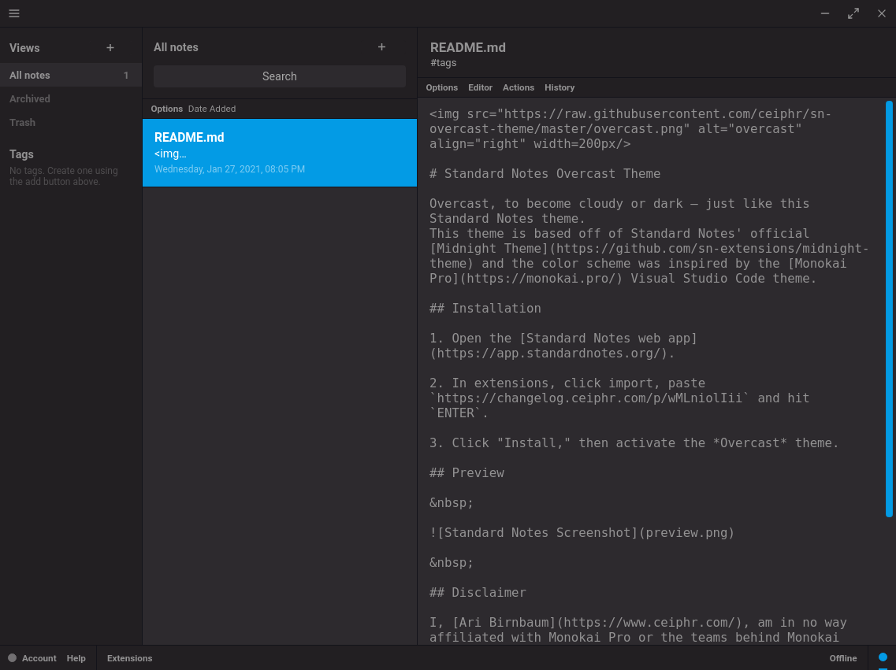

# Standard Notes Overcast Theme

Overcast, to become cloudy or dark — just like this Standard Notes theme.
Standard Notes' official [Midnight Theme](https://github.com/sn-extensions/midnight-theme) is the basis for this theme. While the [Monokai Pro VS Code theme](https://monokai.pro/) acted as inspiration for the colors used.

## Installation

1. Open the [Standard Notes web app](https://app.standardnotes.org/).

2. In extensions, click import, paste `https://changelog.ceiphr.com/p/wMLniolIii` and hit `ENTER`.

3. Click "Install," then activate the *Overcast* theme.

## Preview

&nbsp;

&nbsp;

## Disclaimer

I, [Ari Birnbaum](https://www.ceiphr.com/), am in no way affiliated with Monokai Pro or the teams behind Monokai Pro. Nor am I affiliated with Standard Notes or the teams behind Standard Notes.

## License

Standard Notes Overcast Theme is available under the MIT License.

MIT © [Ari Birnbaum (Ceiphr)](https://www.ceiphr.com).
